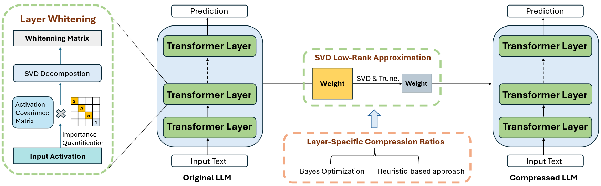

## Introduction
  
**[DipSVD: Dual-importance Protected SVD for Efficient LLM Compression](https://arxiv.org/pdf/2506.20353)** [[arXiv]](https://arxiv.org/pdf/2506.20353)   


### Abstract
Compared to quantization and unstructured pruning, SVD compression offers superior hardware compatibility and theoretical guarantees. However, existing SVD-based methods focus on the overall discrepancy between the original and compressed matrices while overlooking the protection of critical components within the matrix, which leads to inferior performance in the compressed models. This paper proposes a dual-level importance protection mechanism to enhance SVD-based compression methods: (1) local importance protection: preserving the most critical singular vectors within each weight matrix through channel-weighted data whitening; and (2) global importance protection: enabling less important layers to bear a greater portion of the compression burden through either a heuristic or optimization-based approach, thereby minimizing the impact of compression on critical layers. Extensive experiments demonstrate that DipSVD outperforms existing SVD-based compression approaches across multiple benchmarks, achieving superior model performance especially at high model compression ratios.


## Preparation
Please keep the version of the transformers package exactly equal to 4.35.2 since the svd-compressed version of LLM has a slight change of model structure (in the `component/.` folder).
```
pip install -r requirements.txt
```
Models we used in article:

  | Source<br>Model | Pruning<br>Ratio | 🤗Hugging Face<br>Link 
  |:---:|:---:|:---:|
  | Llama-7B | 20%, 35% | [Llama-7B](https://huggingface.co/huggyllama/llama-7b) 
  | Llama-13B | 20%, 35% | [Llama-13B](https://huggingface.co/huggyllama/llama-13b) 
  | DeepSeek-7B | 20%, 35% | [DeepSeek-7B](https://huggingface.co/deepseek-ai/deepseek-llm-7b-chat) 
  | Vicuna-v1.3-7B | 20%, 35% | [Vicuna-v1.3-7B ](https://huggingface.co/lmsys/vicuna-7b-v1.3) 
  | Vicuna-v1.3-13B | 20%, 35% |[Vicuna-v1.3-7B ](https://huggingface.co/lmsys/vicuna-13b-v1.3) 


## Usage

To try our pruning method, use:
```
bash dipsvd.sh
```

Specifically, the compression process is divided into several steps:
    
### Step1: Layer Whitening.
We first run the data whitening of the LLM and saved the weight along with the whitening information.

```
CUDA_VISIBLE_DEVICES=0 python dipsvd.py \
--step 1  \
--model HUGGINGFACE_MODEL_REPO \
--whitening_nsamples WHITENING_SAMPLE_NUMBER \
--dataset WHITENING_DATASET \
--seed SAMPLING_SEED \
--DEV cpu \
--model_seq_len MODEL_SEQ_LEN \
--save_path STEP1_SAVING_PATH
```


### Step2: Layer-Specific Compression Ratios.

Step 2 is used to calculate the compression ratio for each layer, and we employed two methods. The Bayesian method is computed by specifying step==2 in the following script (dipsvd.sh), while the heuristic method is computed using the script draw_svd.ipynb.


```
CUDA_VISIBLE_DEVICES=0 python dipsvd.py \
--step 2  \
--ratio COMPRESSION_RATIO \
--model HUGGINGFACE_MODEL_REPO \
--whitening_nsamples WHITENING_SAMPLE_NUMBER \
--dataset WHITENING_DATASET \
--seed SAMPLING_SEED \
--DEV 'cuda:0' \
--model_seq_len MODEL_SEQ_LEN \
--save_path STEP2_SAVING_PATH
--profiling_mat_path STEP1_SAVING_PATH
```


###  Step3: SVD Low-Rank Approximation.
Applies compression and saves the final model:

```
CUDA_VISIBLE_DEVICES=0 python dipsvd.py \
--step 3  \
--ratio COMPRESSION_RATIO \
--model HUGGINGFACE_MODEL_REPO \
--whitening_nsamples WHITENING_SAMPLE_NUMBER \
--dataset WHITENING_DATASET \
--seed SAMPLING_SEED \
--DEV_ORI 'cuda:0' \
--DEV 'cuda:0' \
--model_seq_len MODEL_SEQ_LEN \
--save_path STEP3_SAVING_PATH
--profiling_mat_path STEP1_SAVING_PATH
```


## Evaluation

To evaluate our pruning method, use:
```
bash eval.sh
```
### Perplexity Evaluation

```
python eval.py \
--ratio COMPRESSION_RATIO \
--step 5 \
--DEV cuda:0 \
--eval_data EVALUATION_DATASET \
--seed SAMPLING_SEED \
--model_path COMPRESSD_MODEL_SAVING_PATH 
```

### Efficiency Evaluation:
```
python eval.py \
--ratio COMPRESSION_RATIO \
--step 6 \
--DEV cuda:0 \
--eval_data EVALUATION_DATASET \
--seed SAMPLING_SEED \
--model_path COMPRESSD_MODEL_SAVING_PATH 
```

### Calibration and Similarity Evaluation between Original and Compressed Model

```
python eval.py \
--ratio COMPRESSION_RATIO \
--step 7 \
--DEV cuda:0 \
--eval_data EVALUATION_DATASET \
--seed SAMPLING_SEED \
--model_path COMPRESSD_MODEL_SAVING_PATH 
```

## Citation
If you find this work useful, please cite
```
@misc{ding2025dipsvddualimportanceprotectedsvd,
      title={DipSVD: Dual-importance Protected SVD for Efficient LLM Compression}, 
      author={Xuan Ding and Rui Sun and Yunjian Zhang and Xiu Yan and Yueqi Zhou and Kaihao Huang and Suzhong Fu and Chuanlong Xie and Yao Zhu},
      year={2025},
      eprint={2506.20353},
      archivePrefix={arXiv},
      primaryClass={cs.LG},
      url={https://arxiv.org/abs/2506.20353}, 
}
```
